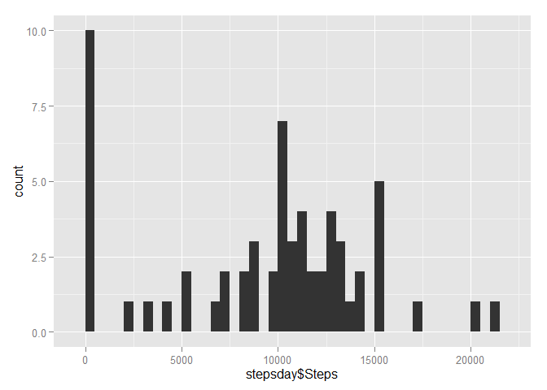
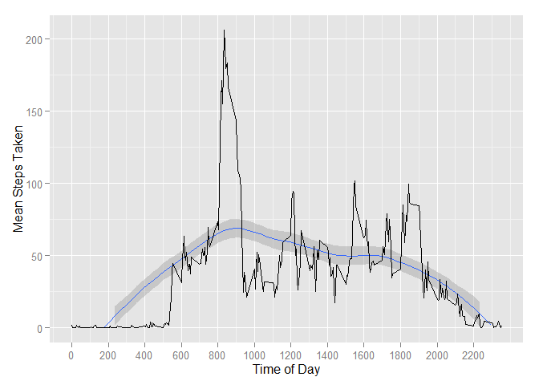
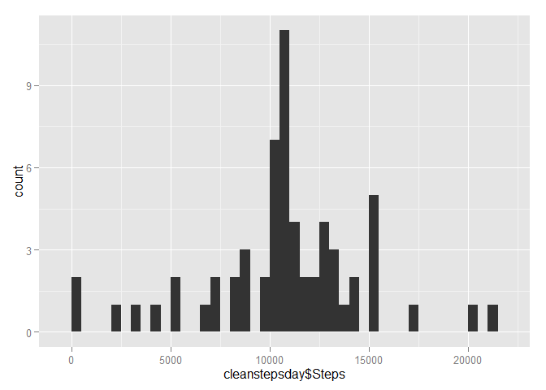
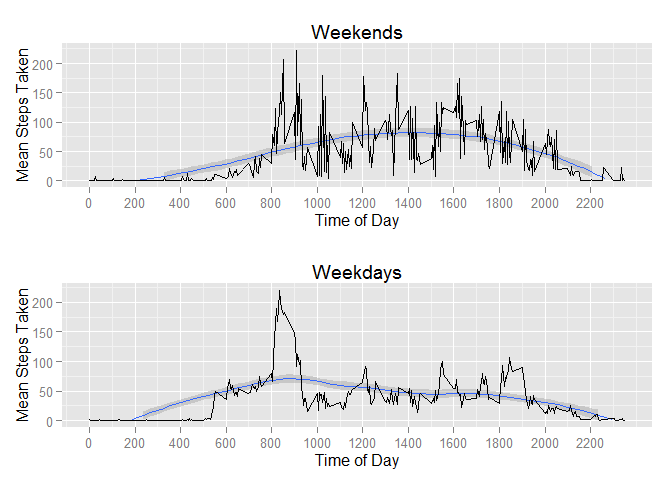

# Reproducible Research: Peer Assessment 1
This assignment makes use of data from a personal activity monitoring device.
This device collects data at 5 minute intervals through out the day. The data
consists of two months of data from an anonymous individual collected during
the months of October and November, 2012 and include the number of steps
taken in 5 minute intervals each day.

The variables included in this dataset are:
. steps: Number of steps taking in a 5-minute interval (missing values are
coded as NA)
. date: The date on which the measurement was taken in YYYY-MM-DD
format
. interval: Identifier for the 5-minute interval in which measurement was
taken

## Loading and preprocessing the data

```r
unzip("activity.zip")
activity <- read.csv("activity.csv", header = TRUE, stringsAsFactors = FALSE)

str(activity)
```

```
## 'data.frame':	17568 obs. of  3 variables:
##  $ steps   : int  NA NA NA NA NA NA NA NA NA NA ...
##  $ date    : chr  "2012-10-01" "2012-10-01" "2012-10-01" "2012-10-01" ...
##  $ interval: int  0 5 10 15 20 25 30 35 40 45 ...
```

```r
## dates are in the wrong class
activity$date <- as.Date(activity$date)
```


## What is mean total number of steps taken per day?

1. Calculate the total number of steps taken per day

2. Make a histogram of the total number of steps taken each day

3. Calculate and report the mean and median of the total number of steps taken per day

```r
library(ggplot2)
#aggregate the number of steps by date
stepsday <- aggregate(activity$steps, by = list(activity$date), FUN = sum, na.rm = TRUE)

#rename the columns
names(stepsday) <- c("Date","Steps")

#calculate the mean
meanstepsday <- mean(stepsday$Steps)

#calculate the median
medianstepsday <- median(stepsday$Steps)


#plot the histogram:
ggplot(stepsday, aes(stepsday$Steps))+
  geom_histogram(binwidth = 500)
```

 

```r
#The mean number of steps taken per day is:
meanstepsday
```

```
## [1] 9354.23
```

```r
#and the median number of steps taken per day is:
medianstepsday
```

```
## [1] 10395
```


## What is the average daily activity pattern?

1. Make a time series plot (i.e. type = "l") of the 5-minute interval (x-axis) and the average number of steps taken, averaged across all days (y-axis)

2. Which 5-minute interval, on average across all the days in the dataset, contains the maximum number of steps?

```r
library(ggplot2)
stepsinterval <- aggregate(activity$steps, by = list(activity$interval), FUN = mean, na.rm = TRUE)
names(stepsinterval) <- c("Interval", "Mean_Steps")

#Plot as a time series
ggplot(stepsinterval, aes(Interval, Mean_Steps))+
  labs(x = "Time of Day", y = "Mean Steps Taken")+
  ylim(0,max(stepsinterval$Mean_Steps))+
  scale_x_continuous(breaks = round(seq(0,max(stepsinterval$Interval), by = 200),1))+
  geom_smooth(method = "loess")+
  geom_line()
```

```
## Warning: Removed 8 rows containing missing values (geom_path).
```

 

```r
#The five minute interval with maximum mean number of steps is:
max <- stepsinterval[which.max(stepsinterval$Mean_Steps),1]
max
```

```
## [1] 835
```


## Imputing missing values

1. Calculate and report the total number of missing values in the dataset (i.e. the total number of rows with NAs)

2. Devise a strategy for filling in all of the missing values in the dataset. The strategy does not need to be sophisticated. For example, you could use the mean/median for that day, or the mean for that 5-minute interval, etc.

3. Create a new dataset that is equal to the original dataset but with the missing data filled in.

4. Make a histogram of the total number of steps taken each day and Calculate and report the mean and median total number of steps taken per day. Do these values differ from the estimates from the first part of the assignment? 

What is the impact of imputing missing data on the estimates of the total daily number of steps?

```r
NAS <- sum(is.na(activity))
#There are this many missing values:
NAS
```

```
## [1] 2304
```

```r
Complete <- sum(complete.cases(activity))
#And there are this many complete cases:
Complete
```

```
## [1] 15264
```

```r
#We'll replace the missing intervals with the mean of the steps in the completed intervals:
clean <- cbind(activity, stepsinterval[,2])
names(clean)[4] <- "mean"
clean$steps <- ifelse(is.na(clean$steps), clean$mean, clean$steps)


#aggregate the number of steps by date
cleanstepsday <- aggregate(clean$steps, by = list(clean$date), FUN = sum, na.rm = TRUE)

#rename the columns
names(cleanstepsday) <- c("Date","Steps")

#calculate the mean
clean.meanstepsday <- mean(cleanstepsday$Steps)

#calculate the median
clean.medianstepsday <- median(cleanstepsday$Steps)

#plot the histogram:
ggplot(cleanstepsday, aes(cleanstepsday$Steps))+
  geom_histogram(binwidth = 500)
```

 

```r
#The mean number of steps taken per day is:
clean.meanstepsday
```

```
## [1] 10766.19
```

```r
#and the median number of steps taken per day is:
clean.medianstepsday
```

```
## [1] 10766.19
```

```r
# Adding in the imputed values increases both the mean and the median number of steps per day
# The mean and median are now identical.
```


## Are there differences in activity patterns between weekdays and weekends?
1. Create a new factor variable in the dataset with two levels - "weekday"
and "weekend" indicating whether a given date is a weekday or weekend
day.
2. Make a panel plot containing a time series plot (i.e. type = "l") of the
5-minute interval (x-axis) and the average number of steps taken, averaged
across all weekday days or weekend days (y-axis). The plot should look
something like the following, which was creating using simulated data:

```r
clean$weekday <- weekdays(clean$date)

wkend <- subset(clean, clean$weekday == c("Saturday","Sunday"))
wkday <- subset(clean, clean$weekday != c("Saturday","Sunday"))

clean.wkend.interval <- aggregate(wkend$steps, by = list(wkend$interval), FUN = mean)
names(clean.wkend.interval) <- c("Interval", "Mean_Steps")

clean.wkday.interval <- aggregate(wkday$steps, by = list(wkday$interval), FUN = mean)
names(clean.wkday.interval) <- c("Interval", "Mean_Steps")

#Plot weekend time series
wendplot <- ggplot(clean.wkend.interval, aes(Interval, Mean_Steps))+
  labs(x = "Time of Day", y = "Mean Steps Taken", title = "Weekends")+
  ylim(0,max(clean.wkend.interval$Mean_Steps))+
  scale_x_continuous(breaks = round(seq(0,max(clean.wkend.interval$Interval), by = 200),1))+
  geom_smooth(method = "loess")+
  geom_line()

#Plot weekday time series
wdayplot <- ggplot(clean.wkday.interval, aes(Interval, Mean_Steps))+
  labs(x = "Time of Day", y = "Mean Steps Taken", title = "Weekdays")+
  ylim(0,max(clean.wkday.interval$Mean_Steps))+
  scale_x_continuous(breaks = round(seq(0,max(clean.wkday.interval$Interval), by = 200),1))+
  geom_smooth(method = "loess")+
  geom_line()

library(gridExtra)
grid.arrange(wendplot, wdayplot, ncol=1)
```

```
## Warning: Removed 10 rows containing missing values (geom_path).
```

```
## Warning: Removed 8 rows containing missing values (geom_path).
```

 

```r
# There is a very clear morning peak during the weekdays, while at the weekend 
# activity is spread out a bit more evenly.
```

